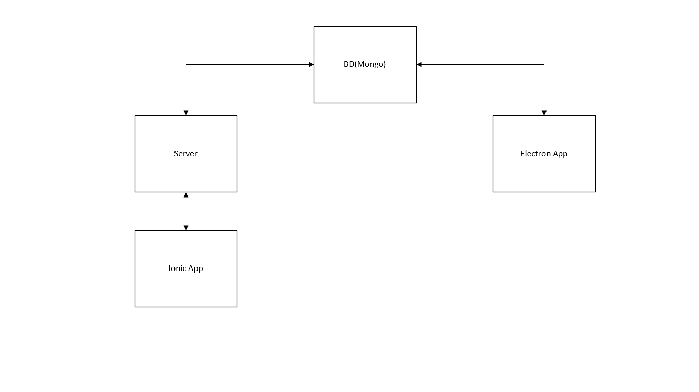

# Minicurso sistema Mean stack

Este Minicurso tem como objetivo guiar você na emocionante jornada de descoberta de duas ferramentas de desenvolvimento - [Ionic] e [Electron].

## Introdução

### Tecnologias
Para este tutorial, é necessário ter instalados e configurados:
* [MongoDB]
* [Node.js]
* [Ionic]
* [Electron]
* [Gulp]

Para que tudo funcione direitinho, é preciso que os binários do `node` e `mongo` estejam adicionados nas variáveis de ambiente.

Para usar o Ionic, você pode seguir as instruções descritas [neste link](http://ionicframework.com/docs/guide/installation.html).

### Por onde começar?
Depois de ter configurado todos as tecnologias, é hora de entender como este tutorial funciona.

Após clonar este repositório, entre na pasta do projeto e, para instalar as dependências, rode os seguintes comandos:
``` sh
npm install
gulp install
```


### O que esse conjunto vai fazer

As aplicações exemplo tem como objetivo mostrar como realizar uma conexão com banco de dados. No caso do Ionic, utilizaremos um servidor em node para alimentar a aplicação, enquanto no caso do Electron, a conexão com o banco será feita de forma direta.

A imagem abaixo apresenta a arquitetura da aplicação.


A estrutura de dados abaixo representa o Schema da nossa [collection](https://docs.mongodb.com/manual/reference/glossary/#term-collection) `users`.
```js
{
  name: String,
  role: String,
  picture: String,
  description: String
}
```


### O Server

Para construir o servidor da aplicação em Ionic, foi utilizada a biblioteca [Xablaujs].

Existem duas maneiras de rodar o server.

1. Executando o comando `gulp server` na raiz do projeto, precisando de uma instancia do MongoDB rodando localmente (`mongod`), sem usuário nem senha.
2. Dentro da pasta `caminho/do/projeto/Server`, execute diretamente com `node index [options]`. Para ver as opções `node index --help`

Para acessar todos os usuários cadastrados no banco de dados, basta acessar a url:
`http://localhost:8080/user`

P.S.: Caso tenha modificado a porta do servidor na linha de comando trocar a porta `8080` para a escolhida por você.

### A aplicação em Electron
O Electron é uma ferramente de desenvolvimento de aplicativos desktop usando tecnologias web. Para a criação da interface usaremos o Photon (http://photonkit.com/), um framework css feito para electron. Ele pode ser baixado em seu site oficial, mas nosso projeto inicial já está com seus arquivos.

#### Configurando o Photon

Para inclui-lo em nosso app, devemos inserir no arquivo `index.html` a seguinte linha:
``` html
<link rel="stylesheet" href="assets/css/photon.css" />
```
logo abaixo do trecho a seguir:
``` html
<!DOCTYPE html>
<html lang="pt-BR" ng-app="app">
<head>
    <title>Electron Minicurso</title>
    <meta charset="utf-8">
    <meta http-equiv="X-UA-Compatible" content="IE=edge">
    <meta name="description" content="">
    <meta name="viewport" content="initial-scale=1, maximum-scale=1, user-scalable=no" />
    <link rel="stylesheet" href="assets/css/style.css" />
```

#### Iniciando com a interface

A documentação do framework, com exemplos de uso, pode ser encotrada em seu site.

A view da aplicação está localizada no arquivo `electron/app/scripts/app/base.html`. A meta é criar uma tela, contendo uma lista de usuários e um formulário para inserir novos usuários ou editar os usuários selecionados. Para criar a base dessa interface, apague tudo e adicione o seguinte trecho de código:

``` html
<div class="window"> <!-- Photon window class -->
  <div class="window-content"> <!-- photon window-content class -->
    <div class="pane-group"> <!-- photon container -->
      <div class="pane-sm sidebar"> <!-- photon sidebar -->
        <ul class="list-group"> <!-- photon ui list -->
          <li class="list-group-header"> <!-- photon list header -->
            <strong>Employees</strong>
            <button class="btn btn-mini btn-positive">
              <span class="icon icon-plus"></span>
            </button>
          </li>
          <li class="list-group-item"> <!-- photon item list -->
             <!-- item-image -->
            <div class="media-body"> <!-- list content -->
              <strong>Frodo Baggins</strong> <!-- item-title -->
              <p>Bearer of the One Ring</p> <!-- item-content -->
            </div>
          </li>
        </ul>
      </div>
      <div class="pane content">
        <form> <!-- form ui -->
          <div class="form-group">
            <label>Full Name</label>
            <input type="text" class="form-control" placeholder="Full Name" name="user-name">
          </div>
          <div class="form-group">
            <label>Role</label>
            <input type="text" class="form-control" placeholder="Author" name="user-role">
          </div>
          <div class="form-group">
            <label>Picture URL</label>
            <input type="url" class="form-control" placeholder="Picture" name="user-picture">
          </div>
          <div class="form-group">
            <label>Description</label>
            <textarea class="form-control" placeholder="Description" name="user-description" rows="3"></textarea>
          </div>
          <div class="form-actions">
            <button type="submit" class="btn btn-form btn-primary">Save</button>
          </div>
        </form>
      </div>
    </div>
  </div>
</div>
```

Observando um pouco nossa tela, a interface ainda tem alguns problemas de alinhamento. Para corrigir isso, devemos fazer algumas modificações em nosso CSS, localizado em `assets/css/style.css`.
Apague tudo dentro dele e insira o seguinte trecho de código:

``` css
/* CSS RESET */
*{
  margin:0;
  padding:0;
}

/* CSS APP */
.content{ /* form padding */
  padding: 20px;
}

.inner.pane{ /* form margin-top */
  margin-top: 10px;
}
```

#### Implementando o módulo do banco de dados
Em toda janela criada pelo electron, ele cria um novo `Renderer Process` que é responsável por controlar a interface e se comunicar com o `Main Process`, no caso ele seria nosso arquivo `main.js`. Dentro do `Renderer Process` é possível executar códigos de bibliotecas, que seriam disponíveis apenas dentro do nodejs (como o mongoose), diretamente. Então criaremos uma Service que implementa o mongoose.


Para trabalhar com o banco de dados usaremos o pacote mongoose, um framework que facilita o trabalho em cima do MongoDB em tarefas como validação e consistência dos dados.

Para saber mais sobre ele consultar o seu site: [http://mongoosejs.com/](http://mongoosejs.com/)

Crie a seguinte pasta no projeto `electron/app/scripts/app/db`. Dentro dela colocaremos todos os códigos referentes à nossa conexão com o banco de dados.

Para conectar nossa aplicação ao banco de dados vamos criar uma service chamada `DBService`. Então o próximo passo é criar um arquivo chamado `DBService.js` na pasta recém criada.

Essa `service` conterá métodos para criar e destruir nossa conexão ao banco de dados, para isso insira no arquivo o seguinte código:

```js
'use strict';
angular.module('app.db', [])
  .service('DBService', ['$q', DBService]);

function DBService($q) {
  let mongoose = require('mongoose');
  let db_settings = { //DEFAULT DB SETTINGS
    server: 'localhost',
    port: 27017,
    dbname: 'meancourse'
  }
  let service = {};

  service.mongoose = mongoose;

  service.setDBSettings = function(db_info){
    if(db_info !== undefined)
      db_settings = db_info;
  }

  service.connect = function(db_info){
    if(db_info !== undefined) // Atualizando os dados de conexão do banco de dados
      service.setDBSettings(db_info);
    let connString = 'mongodb://';
    if(db_settings.user && db_settings.password)
      connString += `${db_settings.user}:${db_settings.password}@`;
    connString+= `${db_settings.server}:${db_settings.port}/${db_settings.dbname}`;
    try{
      mongoose.connect(connString); // Criando conexão
    }catch(e){
      console.log(e);
    }
  }

  service.disconnect = function(){
    try{
      mongoose.connection.close(); // Fechando conexão
    }catch(e){
      console.log(`can't disconnect`);
    }
  };

  return service; // Exportando a service
}
```

Depois de criado, para a `service` funcionar devemos chamar o arquivo em nosso `index.html` e incluir o módulo `app.db` no arquivo app.js

No arquivo `index.html` insira logo abaixo do último script da nossa página:

```html
<script src="./scripts/app/baseController.js"></script>
```

A seguinte tag `html`:

```html
<script src="./scripts/app/db/DBService.js"></script>
```

Já no arquivo `/scripts/app.js`, adicione a String `app.db`, no vetor de módulos, ficando da seguinte forma:

```js
angular.module('app', [
  'ngRoute',
  'app.db'
])
```

Feito isso, nossa aplicação está pronta para se conectar com o banco de dados. Agora chegou a hora de criar nosso `Model` do mongoose.
Dentro da pasta de arquivos do banco de dados (`electron/app/scripts/app/db`), crie uma outra pasta chamada `model`. Dentro dela colocaremos todos as estruturas de dados que serão armazenadas em nosso banco. No nosso caso criaremos apenas um arquivo chamado `user.js` que será nossa estrutura de usuários.

Dentro dele insira o seguinte código:

```js
(function(){ // Tornando o escopo anônimo
  'use strict';
  const mongoose = require('mongoose'); // Incluindo módulo mongoose

  // Schemas do Mongoose http://mongoosejs.com/docs/guide.html
  const User = mongoose.Schema({ // Criando Schema
    name: {
      type: String,
      required: true
    },
    role: String,
    picture: String,
    description: String
  });

  window.User = mongoose.model("user", User); // Transformando o Schema em um model do Mongoose, e transformando a referência do model em uma váriavel global.
})()
```

No arquivo `index.html` invoque esse script logo abaixo do ultimo script chamado:

```html
<script src="./scripts/app/db/model/user.js"></script>
```

Agora para usar esse modelo, e servir nossa aplicação com esses dados vamos criar uma outra service chamada `UserService`. Na pasta de arquivos do banco de dados, crie um arquivo chamado `UserService.js`. Ele conterá o CRUD básico referente aos dados de `Usuários`. Nesse arquivo insira o código abaixo:

```js
(function(){
  'use strict';
  angular.module('app.db')
    .service('UserService', ['DBService', '$q', UserService]);

  function UserService(DBService, $q) { // Nossa service de conexão com o bd, e um módulo para criação de promises.
    let service = {};

    service.setDBSettings = DBService.setDBSettings; // Tornando público as configurações do banco de dados

    // Find Users

    service.getAll = function(){ // Retorna todos os Users do BD
      return service.find({});
    }

    service.find = function(search){ // Retorna todos os User do BD que batem com os parametros
      let deferred = $q.defer();
      DBService.connect(); // Conecta com o banco de dados
      User.find(search, function(err, items){
        DBService.disconnect(); // Assim que terminar de mexer com o BD, feche a conexão por motivos de segurança e para não sobrecarregar seu SGBD
        if(err)
          return deferred.reject(err); // Em caso de erro, manda uma falha para a promise
        return deferred.resolve(items); // Em caso de sucesso, resolve a promessa com os dados obtidos.
      })
      return deferred.promise; // Retorna a promise para trabalhar em cima
    }

    service.getOne = function(search){ // Retorna apenas um User do BD que bata com os parametros passados
      let deferred = $q.defer();
      DBService.connect();
      User.findOne(search, function(err, item){
        DBService.disconnect();
        if(err)
        return deferred.reject(err);
        return deferred.resolve(item);
      })
      return deferred.promise;
    }

    // Insert User

    service.insert = function(user_data){ // Insere um usuário no bd.
      let deferred = $q.defer();
      DBService.connect();
      let user = new User(user_data); // Cria um Usuário
      user.save((err) => { // Insere ele no banco de dados
        DBService.disconnect();
        if(err)
          return deferred.reject(err);
        return deferred.resolve(user_data);
      })
      return deferred.promise;
    }

    // Edit User
    service.update = function(user_data){ // Modifica um usuário do bd
      let deferred = $q.defer();
      DBService.connect();
      User.findById(user_data._id, function(err, user){ // Busca um usuário pela id
        if(err){
          return deferred.reject(err); // Em caso de erro na query ou não encontrar retorna uma falha
        }
        // Modifica os campos originais
        user.name = user_data.name;
        user.role = user_data.role;
        user.picture = user_data.picture;
        user.description = user_data.description;

        user.save((err) => { // Salva os novos dados
          DBService.disconnect();
          if(err){
            return deferred.reject(err);
          }
          return deferred.resolve(user);
        })
      })
      return deferred.promise;
    }

    // Remove User
    service.remove = function(user_data){ // Remove um usuário do banco de dados
      let deferred = $q.defer();
      DBService.connect();
      User.remove(user_data, function(err, op){
        if(err){
          return deferred.reject(err);
        }
        return deferred.resolve(op);
      })

      return deferred.promise;
    }

    return service;
  }
})()
```

Agora inclua esse script em seu arquivo `index.html` logo abaixo do nosso model `user.js`.

```html
<script src="./scripts/app/db/UserService.js"></script>
```

Agora que estruturamos todo nosso sistema e criamos os meios para nossa aplicação se conectar com o banco de dados, vamos jogar os dados do banco de dados na tela.
Para isso iremos editar o arquivo `scripts/app/baseController.js`.

Nosso novo `BaseController` ficará da seguinte maneira:

```js
'use strict';
angular.module('app')
  .controller('baseController', ['$scope', 'UserService', BaseController]); // Aqui devemos incluir a nossa UserService no BaseController

function BaseController($scope, UserService) { // Adicionando o paramêtro para que o Angular faça a injeção da váriavel.
  // Private attributes
  let currentUserIndex = -1; // Variável interna para guardar refêrencia do usuário selecionado.

  // Private functions
  function loadUsers(){ // Método privado que atualiza os usuários do nosso controller
    UserService.getAll().then(
      (users) => { //arrow functions
        $scope.users = users;
      },
      (err, data) => {
        console.log(err, data);
      }
    )
  }

  // public attributes || Váriaveis que a view terá acesso
  $scope.users = []; // Lista de usuários
  $scope.currentUser = {}; // Usuário que está, ou não, sendo editado no momento

  // public methods
  $scope.newUser = function(){ // Método para limpar o formulário, para criar um novo usuário
    currentUserIndex = -1;
    $scope.currentUser = {};
  }

  $scope.editUser = function($index){ // Método para jogar o usuário atual no formulário para edição
    currentUserIndex = $index;
    $scope.currentUser = $scope.users[currentUserIndex];
  }

  $scope.removeUser = function(){ // Método que implementa o método de remoção de usuário. Chamado quando clicarem no botão de remoção dentro da view
    UserService.remove($scope.currentUser).then(
      (op) => {
        console.log("removed");
        loadUsers();
        $scope.newUser();
      },
      (err,data) => {
        console.log("not removed");
      }
    )
  }

  $scope.save = function(){ // Método que implementa o botão de salvar os dados do formulário.
    let new_user = currentUserIndex == -1;
    if(new_user){ // Se está criando um novo usuário chama a função de insert
      // save
      UserService.insert($scope.currentUser).then(
        (success) => {
          console.log("New user was added into your database");
          loadUsers();
          $scope.newUser();
        },
        (err, data) => {
          console.log("Error: Can't add the new user into your database");
          console.log(err, data);
        }
      )
    }else{ // Senão chama a função de update
      // update
      UserService.update($scope.currentUser).then(
        (success) => {
          console.log("User Updated");
          loadUsers();
          $scope.newUser();
        },
        (err, data) => {
          console.log("Error: Can't Update user");
          console.log(err, data);
        }
      )
    }
  }


  // On init
  $scope.$on('$routeChangeSuccess', function () { // Quando o angular emitir um evento de alteração de rotas(ou seja, quando a página carregar) chamar o método para atualizar a lista de usuários.
    loadUsers();
  });
}
```

Uma vez que nosso controlador está se comunicando com o BD e já tem seus métodos, vamos alterar a view de maneira que possamos usar estes dados que estamos mandando de um lugar para o outro desde o começo.


Em caso de dúvidas, o código final desta etapa pode ser observado no branch `electron`.

### A aplicação em Ionic

[MongoDB]: <https://www.mongodb.com/download-center#community>
[Node.js]: <http://nodejs.org>
[AngularJS]: <http://angularjs.org>
[Gulp]: <http://gulpjs.com>
[Ionic]: <http://ionicframework.com/>
[Electron]: <http://electron.atom.io/>
[Xablaujs]: <https://github.com/vinifig/xablaujs>
